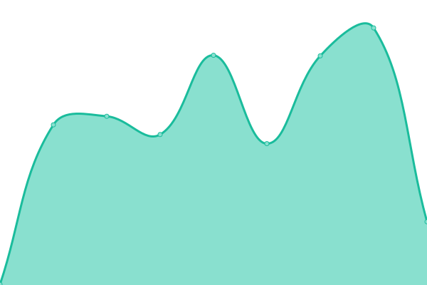
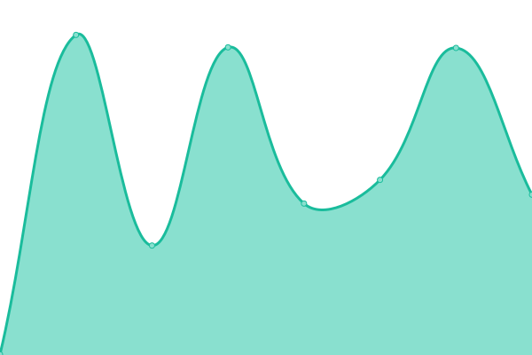
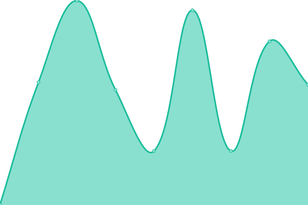
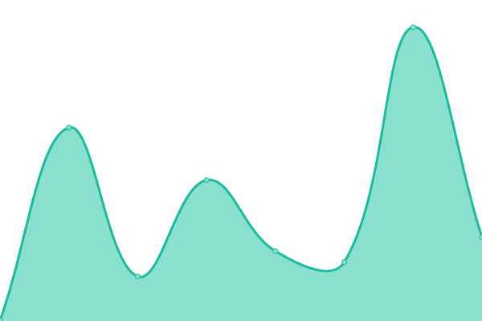
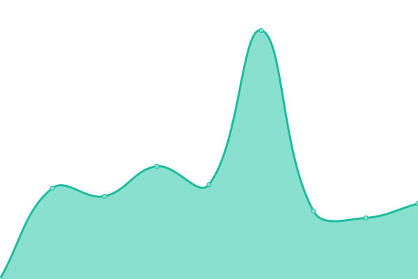

# [📈 Live Status](https://status.moekyun.me): <!--live status--> **🟧 Partial outage**

This repository contains the open-source uptime monitor and status page for [Pinapelz](https://pinapelz.com), powered by [Upptime](https://github.com/upptime/upptime).

With [Upptime](https://upptime.js.org), you can get your own unlimited and free uptime monitor and status page, powered entirely by a GitHub repository. We use [Issues](https://github.com/pinapelz/upptime/issues) as incident reports, [Actions](https://github.com/pinapelz/upptime/actions) as uptime monitors, and [Pages](https://status.moekyun.me) for the status page.

<!--start: status pages-->
<!-- This summary is generated by Upptime (https://github.com/upptime/upptime) -->
<!-- Do not edit this manually, your changes will be overwritten -->
<!-- prettier-ignore -->
| URL | Status | History | Response Time | Uptime |
| --- | ------ | ------- | ------------- | ------ |
|  [Patchwork Archive](https://archive.pinapelz.moe/api/database/status) | 🟥 Down | [patchwork-archive.yml](https://github.com/pinapelz/upptime/commits/HEAD/history/patchwork-archive.yml) | 

 4473ms
     
 | 

<a href="https://status.moekyun.me/history/patchwork-archive">88.70%</a>
    

|  [Patchwork Radio](https://a4.asurahosting.com/api/nowplaying_static/patchworkarchive.json) | 🟩 Up | [patchwork-radio.yml](https://github.com/pinapelz/upptime/commits/HEAD/history/patchwork-radio.yml) | 

 636ms
     
 | 

<a href="https://status.moekyun.me/history/patchwork-radio">100.00%</a>
    

|  [Moekyun Social](https://social.moekyun.me/api/server-info) | 🟥 Down | [moekyun-social.yml](https://github.com/pinapelz/upptime/commits/HEAD/history/moekyun-social.yml) | 

 1471ms
     
 | 

<a href="https://status.moekyun.me/history/moekyun-social">99.98%</a>
    

|  [MoekyunTea (Gitea)](https://git.moekyun.me) | 🟥 Down | [moekyun-tea-gitea.yml](https://github.com/pinapelz/upptime/commits/HEAD/history/moekyun-tea-gitea.yml) | 

 519ms
     
 | 

<a href="https://status.moekyun.me/history/moekyun-tea-gitea">99.99%</a>
    

|  [MoekyunRSS](https://service.moekyun.me/rss) | 🟥 Down | [moekyun-rss.yml](https://github.com/pinapelz/upptime/commits/HEAD/history/moekyun-rss.yml) | 

 394ms
     
 | 

<a href="https://status.moekyun.me/history/moekyun-rss">100.00%</a>
    

|  [Moekyun Link Shortener](https://link.moekyun.me/) | 🟩 Up | [moekyun-link-shortener.yml](https://github.com/pinapelz/upptime/commits/HEAD/history/moekyun-link-shortener.yml) | 

 1121ms
     
 | 

<a href="https://status.moekyun.me/history/moekyun-link-shortener">100.00%</a>
    

|  [Moekyun Karaoke](https://karaoke.moekyun.me/) | 🟩 Up | [moekyun-karaoke.yml](https://github.com/pinapelz/upptime/commits/HEAD/history/moekyun-karaoke.yml) | 

 306ms
     
 | 

<a href="https://status.moekyun.me/history/moekyun-karaoke">100.00%</a>
    

|  [PhaseTracker](https://api.phase-tracker.com/api/channel/Erina%20Makina) | 🟩 Up | [phase-tracker.yml](https://github.com/pinapelz/upptime/commits/HEAD/history/phase-tracker.yml) | 

 993ms
     
 | 

<a href="https://status.moekyun.me/history/phase-tracker">99.75%</a>
    

|  [VTuber Captcha](https://vtuber-captcha.vercel.app/api/affiliation/Hololive) | 🟩 Up | [v-tuber-captcha.yml](https://github.com/pinapelz/upptime/commits/HEAD/history/v-tuber-captcha.yml) | 

 1319ms
     
 | 

<a href="https://status.moekyun.me/history/v-tuber-captcha">100.00%</a>
    

<!--end: status pages-->

[**Visit our status website →**](https://status.moekyun.me)

## 📄 License

- Powered by: [Upptime](https://github.com/upptime/upptime)
- Code: [MIT](./LICENSE) © [Anand Chowdhary](https://anandchowdhary.com), supported by [Pabio](https://pabio.com)
- Data in the `./history` directory: [Open Database License](https://opendatacommons.org/licenses/odbl/1-0/)
