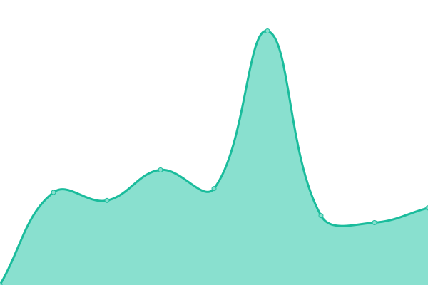
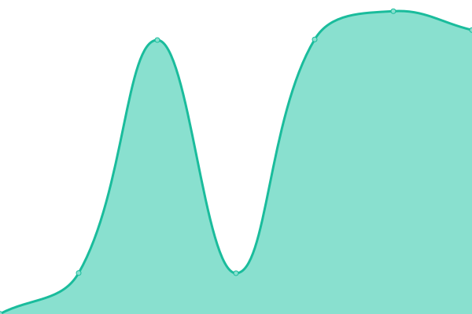

# [📈 Live Status](https://uptime.pinapelz.com): <!--live status--> **🟩 All systems operational**

This repository contains the open-source uptime monitor and status page for [Pinapelz](https://pinapelz.com), powered by [Upptime](https://github.com/upptime/upptime).

With [Upptime](https://upptime.js.org), you can get your own unlimited and free uptime monitor and status page, powered entirely by a GitHub repository. We use [Issues](https://github.com/pinapelz/upptime/issues) as incident reports, [Actions](https://github.com/pinapelz/upptime/actions) as uptime monitors, and [Pages](https://uptime.pinapelz.com) for the status page.

<!--start: status pages-->
<!-- This summary is generated by Upptime (https://github.com/upptime/upptime) -->
<!-- Do not edit this manually, your changes will be overwritten -->
<!-- prettier-ignore -->
| URL | Status | History | Response Time | Uptime |
| --- | ------ | ------- | ------------- | ------ |
|  [Phase Tracker](https://phase-tracker.com) | 🟩 Up | [phase-tracker.yml](https://github.com/pinapelz/upptime/commits/HEAD/history/phase-tracker.yml) | 

 1454ms
     
 | 

<a href="https://uptime.pinapelz.com/history/phase-tracker">100.00%</a>
    

|  [Moekyun Services](https://moekyun.me) | 🟩 Up | [moekyun-services.yml](https://github.com/pinapelz/upptime/commits/HEAD/history/moekyun-services.yml) | 

 1015ms
     
 | 

<a href="https://uptime.pinapelz.com/history/moekyun-services">100.00%</a>
    

|  [Patchwork Archive](https://patchwork-backend.vercel.app/api/database/status) | 🟩 Up | [patchwork-archive.yml](https://github.com/pinapelz/upptime/commits/HEAD/history/patchwork-archive.yml) | 

 598ms
     
 | 

<a href="https://uptime.pinapelz.com/history/patchwork-archive">100.00%</a>
    

<!--end: status pages-->

[**Visit our status website →**](https://uptime.pinapelz.com)

## 📄 License

- Powered by: [Upptime](https://github.com/upptime/upptime)
- Code: [MIT](./LICENSE) © [Anand Chowdhary](https://anandchowdhary.com), supported by [Pabio](https://pabio.com)
- Data in the `./history` directory: [Open Database License](https://opendatacommons.org/licenses/odbl/1-0/)
