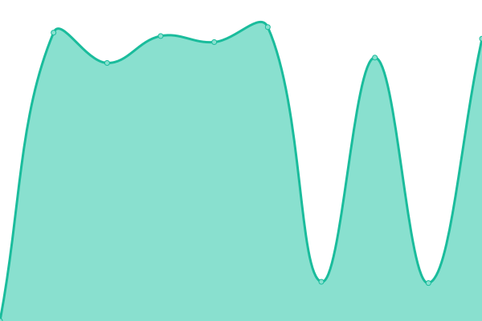
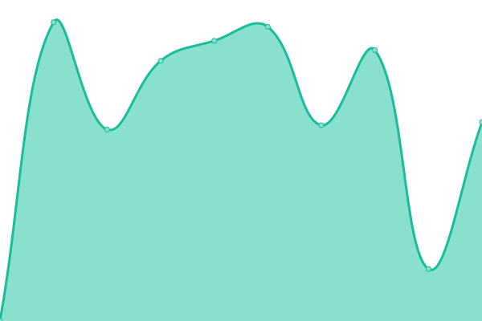

# [📈 Live Status](https://status.moekyun.me): <!--live status--> **🟩 All systems operational**

This repository contains the open-source uptime monitor and status page for [Pinapelz](https://pinapelz.com), powered by [Upptime](https://github.com/upptime/upptime).

With [Upptime](https://upptime.js.org), you can get your own unlimited and free uptime monitor and status page, powered entirely by a GitHub repository. We use [Issues](https://github.com/pinapelz/upptime/issues) as incident reports, [Actions](https://github.com/pinapelz/upptime/actions) as uptime monitors, and [Pages](https://status.moekyun.me) for the status page.

<!--start: status pages-->
<!-- This summary is generated by Upptime (https://github.com/upptime/upptime) -->
<!-- Do not edit this manually, your changes will be overwritten -->
<!-- prettier-ignore -->
| URL | Status | History | Response Time | Uptime |
| --- | ------ | ------- | ------------- | ------ |
|  [Patchwork Archive](https://archive.pinapelz.moe/api/database/status) | 🟩 Up | [patchwork-archive.yml](https://github.com/pinapelz/upptime/commits/HEAD/history/patchwork-archive.yml) | 

 721ms
     
 | 

<a href="https://status.moekyun.me/history/patchwork-archive">99.85%</a>
    

|  [Patchwork Radio](https://a4.asurahosting.com/api/nowplaying_static/patchworkarchive.json) | 🟩 Up | [patchwork-radio.yml](https://github.com/pinapelz/upptime/commits/HEAD/history/patchwork-radio.yml) | 

 720ms
     
 | 

<a href="https://status.moekyun.me/history/patchwork-radio">99.84%</a>
    

|  [Moekyun Link Shortener](https://link.moekyun.me/) | 🟩 Up | [moekyun-link-shortener.yml](https://github.com/pinapelz/upptime/commits/HEAD/history/moekyun-link-shortener.yml) | 

 1497ms
     
 | 

<a href="https://status.moekyun.me/history/moekyun-link-shortener">99.85%</a>
    

|  [PhaseTracker](https://api.staging.phase-tracker.com/index.html) | 🟩 Up | [phase-tracker.yml](https://github.com/pinapelz/upptime/commits/HEAD/history/phase-tracker.yml) | 

 415ms
     
 | 

<a href="https://status.moekyun.me/history/phase-tracker">100.00%</a>
    

|  [VTuber Captcha](https://vtuber-captcha.vercel.app/api/affiliation/Hololive) | 🟩 Up | [v-tuber-captcha.yml](https://github.com/pinapelz/upptime/commits/HEAD/history/v-tuber-captcha.yml) | 

 1739ms
     
 | 

<a href="https://status.moekyun.me/history/v-tuber-captcha">99.85%</a>
    

|  [Leciel (Tachi)](https://leciel.pinapelz.com/api/v1/config) | 🟩 Up | [leciel-tachi.yml](https://github.com/pinapelz/upptime/commits/HEAD/history/leciel-tachi.yml) | 

 337ms
     
 | 

<a href="https://status.moekyun.me/history/leciel-tachi">100.00%</a>
    

|  [Leciel ~Pharia~ (eAmuse)](https://pharia.pinapelz.com) | 🟩 Up | [leciel-pharia-e-amuse.yml](https://github.com/pinapelz/upptime/commits/HEAD/history/leciel-pharia-e-amuse.yml) | 

 294ms
     
 | 

<a href="https://status.moekyun.me/history/leciel-pharia-e-amuse">100.00%</a>
    

|  [Leciel ~Quna~ (ALL.Net)](https://kanui.pinapelz.com) | 🟩 Up | [leciel-quna-all-net.yml](https://github.com/pinapelz/upptime/commits/HEAD/history/leciel-quna-all-net.yml) | 

 436ms
     
 | 

<a href="https://status.moekyun.me/history/leciel-quna-all-net">100.00%</a>
    

|  [Moekyun Cloud](https://cloud.moekyun.me/status.php) | 🟩 Up | [moekyun-cloud.yml](https://github.com/pinapelz/upptime/commits/HEAD/history/moekyun-cloud.yml) | 

 900ms
     
 | 

<a href="https://status.moekyun.me/history/moekyun-cloud">100.00%</a>
    

<!--end: status pages-->

[**Visit our status website →**](https://status.moekyun.me)

## 📄 License

- Powered by: [Upptime](https://github.com/upptime/upptime)
- Code: [MIT](./LICENSE) © [Anand Chowdhary](https://anandchowdhary.com), supported by [Pabio](https://pabio.com)
- Data in the `./history` directory: [Open Database License](https://opendatacommons.org/licenses/odbl/1-0/)
